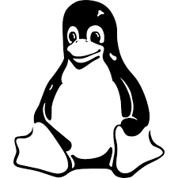
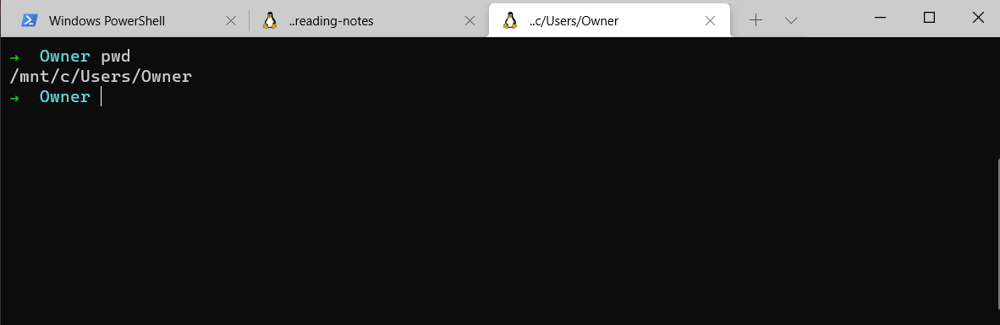
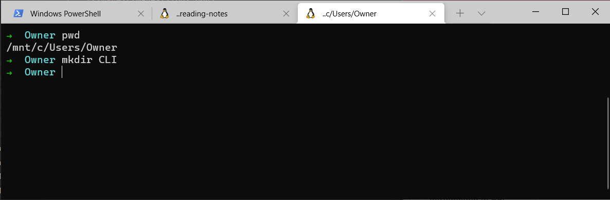
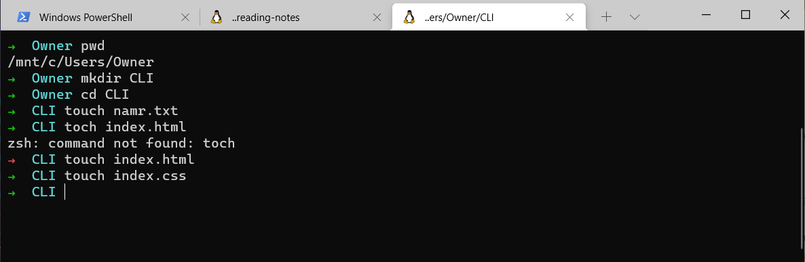
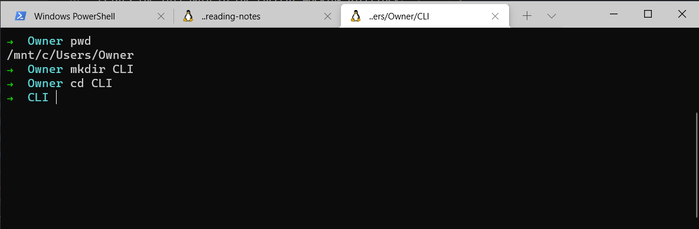
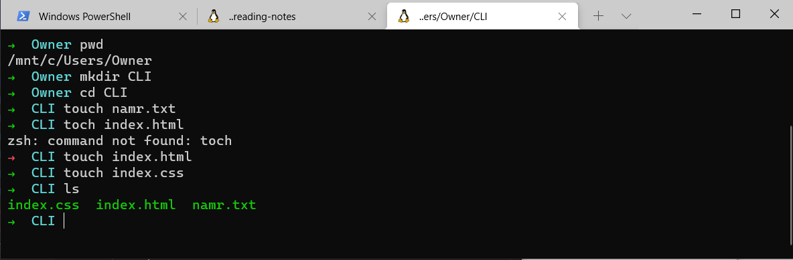
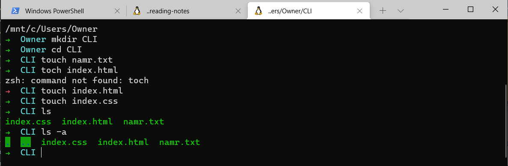
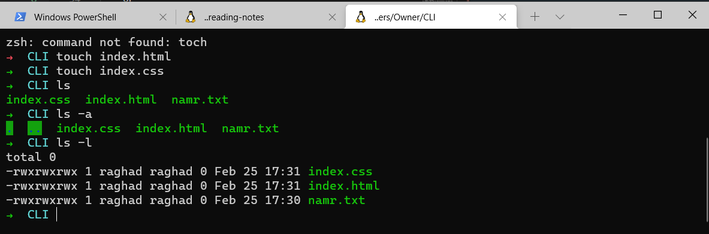
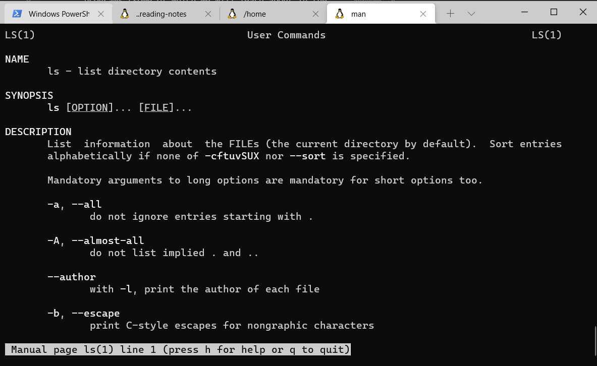

# Command-line interface
CLI processes commands to a computer program in the form of lines of text.

## The Command Line
A command line, or terminal, is a text based interface to the system

### The Shell, Bash
Shell: is a part of the operating system that defines how the terminal will behave and looks after running (or executing) commands.
The most common shell is called bash(Bourne again shell).

    echo $shell
To know which shell you are using 

### Print work directory
    pwd
Prints the full path to the current working directory.

### Create a new directory
    mkdir foldername
To create a new directory.

**Options for mkdir**
- (-p): make parent directories as needed
- (-v): tells what mkdir is doing

### Create a new file in the directory
    touch filename
To create a new file in the directory (ex:name.txt, index.html, index.css, ...etc)

### Change work directory
    cd foldername
To change the working directory to a specified folder.

    cd "folder name" or 'folder name' or folder\ name
To name the folder with spaces use single or double quotes or backslash.

    cd ../../
To change the working directory to a specified folder using the path.

    cd -
To return to $HOME directory.

    cd
    or
    ~
To go to the root. 

    cd ..
To go up a directory.

    cd - 
To return to the previous directory.

### List work directory
Syntax: 
    ls [OPTIONS] [FILES]

    ls
List directory contents.

    ls -a
List all the content, including hidden files.

    ls -l
List the content and its information.

    ls /etc
To list files in a specific directory, pass the directory path as an argument yo the *ls* command.
We can pass multiple directories and files separated by spaces.

    ls -l /etc
To list the contents of files in a specific directory, pass the directory path as an argument yo the *ls* command.
We can pass multiple directories and files separated by spaces.

**Content of the output:**
- Firts Charcter indicator for the file type
- Next 9 Characters are permissions for the file or directory.
- The next field is the number of blocks.
- The next field is the owner of the file or directory.
- The next field is the group the file or directory belongs to.
- Following this is the file size.
- Next up is the file modification time.
- Last thing the actual name of the file or directory.
#### File Types:
| Charcter | File Type |
| --- | ----------- |
| - | Regular file |
| b | Block special file |
| c | Character special file |
| l | Symbolic link |
| d | Directory |
| n | Network file |
| p | FIFO |
| s | Socket |

### Copy work directory
    cp source destination
Copy source to destination.

    cp -r source destination
Copy a directory recursively from source to destination.

### Move work directory
    mv source destination
Move (or rename) a file from source to destination.
We can use mv to rename a file by giving the destination same as the source put with different file name.

### Remove work directory
    rm file1
Remove file1.

    rmdir
Remove a folder.

    rm -r folder 
Remove a directory and its contents recursively.

## Paths:
To get to a specific directory or file on the system.

1. Absolute path:
- Specify a location for a file or directory in relation to the root directory.
- Begins with forward slash /.

2. Relative path:
- Specify a location (file or directory) in relation to where we currently are in the system.
- Does not begin with forward slash.

**To Refrence to:**
- Home Directory: Tilde(~)
- Current Directory: Dot(.)
- Parent Directory: DotDot(..)

**Others:**
- /etc: Stores config files for the system.
- /var/log: Stores log files for various system programs. (You may not have permission to look at everything in this directory. Don't let that stop you exploring though. A few error messages never hurt anyone.)
- /bin: The location of several commonly used programs (some of which we will learn about in the rest of this tutorial.
- /usr/bin: Another location for programs on the system.

## Files:
**Every thing is a file**
Everything is a file with different extensions, even the directory itself is a sepcial kind of file.

## Hidden Files and Directories
When a file or directory's name begins with a (.) then it is considered to be hidden.

**Extensionless System**
A file extension is normally a set of 2 - 4 characters after a full stop at the end of a file, which denotes what type of file it is.
(.css, .html, .txt, .exe, .png, etc.)

**Note: Linux is Case sensitive**

## Manual Pages:
The manual pages are a set of pages that explain every command available on your system including what they do, the specifics of how you run them and what command line arguments they accept.

    man <command to look up>
    To exit the man pages press 'q' for quit.

**Searching**
To search for a command that you know what it will do.
    man -k <search term>
If you want to search within a manual page this is also possible, in the particular manual page you would like to search press:
- Forward slash '/' followed by the term you would like to search for and hit 'enter' 
- If the term appears multiple times you may cycle through them by pressing the 'n' button for next.
    /<term>

## Shortcuts
- To get acess to the previous commands that are written, terminal stores them in a history, traverse this history using the up and down arrow keys.
- To autocomplete the path use Tab key on the keyboard which will invoke an auto complete action.

## Linux Cheat Sheet:
[cheatsheet](https://ryanstutorials.net/linuxtutorial/cheatsheet.php)
