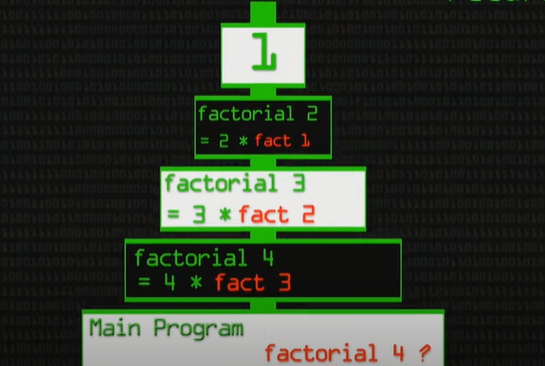

# Lecture#2 - Read02

## In Tests We Trust — TDD with Python

**Unit tests and TDD**

Unit tests: some pieces of code to exercise the input, the output and the behaviour of your code.

Test-driven development (TDD): is a software development process relying on software requirements being converted to test cases before software is fully developed, and tracking all software development by repeatedly testing the software against all test cases.

**Unit tests vs TDD**
Unit testing is writing many small tests that each test one very simple function or object behavior. 
TDD is a thinking process that results in unit tests, and “thinking in tests” tends to result in more fine-grained and comprehensive testing, and an easier-to-extend software design.

*Test Name* test file name should follow the same name of module name.
    filename.py ---> test_filename.py

Note: It’s ideal to separate the tests folder from production code

*Structure* AAA
- Arrange: organize the data needed to execute that piece of code (input)
- Act: execute the code being tested (exercise the behaviour)
- Assert: check if the result (output) is the same as you were expecting
 Now we can execute the test using *pytest*

**The Cycle**
1. Write a unit test and make it fail
2. Write the feature and make the test pass
3. Refactor the code

## What does the if __name__ == “__main__”: do?

A **python intrepreter** is a system software which translates python codes to machine codes to be processed.

A **source file** that contains original or essential data that is the starting point for a system of publishing or other processing.

A **Module** is simply a file with the “.py” extension containing Python code that can be imported inside another Python Program.

Before executing the code, python intrepreter:
- Reads source file
- Define few special global variables

If intrepreter is running the source file as the main program it sets:
    __name__ = __main__

If the intrepreter is running a file that is imported from another module
    __name__ = modules's name

    if __name__ == "__main__":
    print ("Executed when invoked directly")
    else:
    print ("Executed when imported")

## Recursion

Recursive Function
A function that calls itself 
In Recursive Function break the problem in to two parts:
1. Base case when the function stops calling itself to prevent infinite loop
2. Recursive case when the function calls itself 

**Basic Structure:**

if statment (the Base case)
else statment (the recursive case)

    def function_name (parameter):
        if (condition):
        return
        else:
            return the expression to solve a problem 

**Example:**

    def factorial_num(n):

        if (n == 0 or n == 1):
            # 4 != 1 exit
            # 3 != 1 exit
            # 2 != 1 exit
            # 1 == 1 return 1 and stop
            return 1
        else:
            # factorialNum(4) = 4 * factorialNum(3) 
            # factorialNum(3) = 3 * factorialNum(2) 
            # factorialNum(2) = 2 * factorialNum(1) 
            # factorialNum(1) = return 1 = 1
            # 1 * 2 = 2
            # 2 * 3 = 6
            # 6 * 4 = 24
            return n * factorial_num(n - 1)

    print(factorial_num(4))

