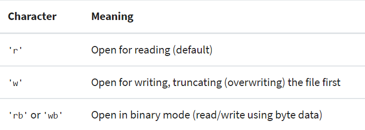
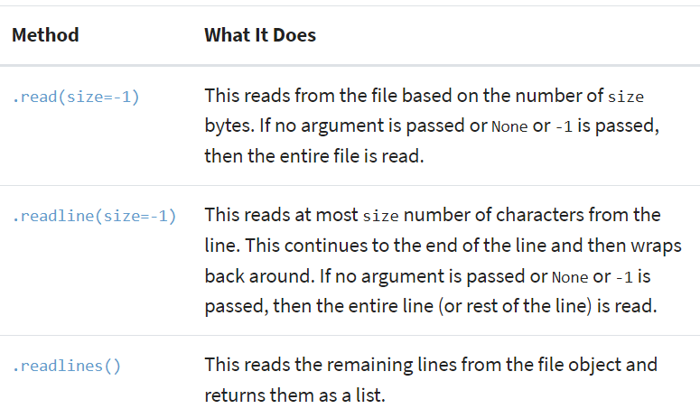
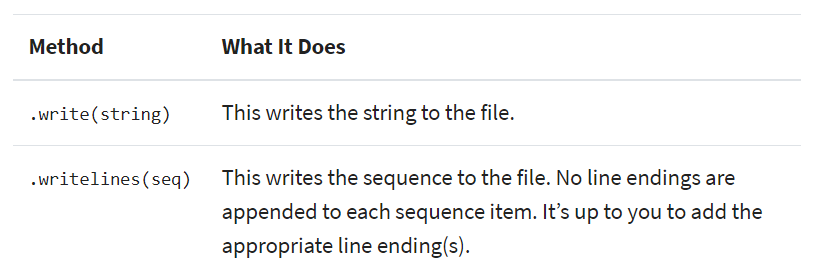

# Reading and Writing Files in Python

## What makes up a file and why that’s important in Python
file: contiguous set of bytes used to store data
data: organized in a specific format and can be anything as simple as a text file or as complicated as a program executable.

--> Byte files are then translated into binary 1 and 0 for easier processing by the computer.

Files are composed of three main parts: 
1. Header: metadata about the contents of the file (file name, size, type, and so on)
2. Data: contents of the file as written by the creator or editor
3. End of file(EOF): special character that indicates the end of the file

### File Paths:
A string that represents the location of a file
Consist of three major parts: 
1. Folder Path: the file folder location on the file system where subsequent folders are separated by a forward slash
2. File Name: the actual name of the file
3. Extension: the end of the file path pre-pended with a period (.) used to indicate the file type

    / = Root directory
    .   = This location
    ..  = Up a directory
    ./  = Current directory
    ../ = Parent of current directory
    ../../ = Two directories backwards

### Line Endings
Windows uses the CR+LF characters to indicate a new line
\n: moves the cursor down to the next line without returning to the beginning of the line.
\r: moves the cursor to the beginning of the line without advancing to the next line

### Character Encodings
An encoding is a translation from byte data to human readable characters, this is typically done by assigning a numerical value to represent a character.

## Opening and Closing a File in Python
To open a file:

    file = open('dog_breeds.txt')

To close a file:

    reader = open('dog_breeds.txt')
    try:
        # Further file processing goes here
    finally:
        reader.close()

    with open('dog_breeds.txt') as reader:
        # Further file processing goes here

Second positional argument(mode):

### File object:
An object exposing a file-oriented API
- Text Files: 
    - open() will return a TextIOWrapper
- Buffered binary files: 
    - is used for reading and writing binary files
    - open() will return either a BufferedReader or BufferedWriter file object
- Raw binary files: 
    - used as a low-level building-block for binary and text streams
    -  open() will return a FileIO file object

## The basics of reading and writing files in Python
Methods called on a file object for reading:

Methods called on a file object for writing:

Note: The end='' is to prevent Python from adding an additional newline to the text that is being printed and only print what is being read from the file.

To work with files using byte strings:
add the 'b' character to the mode argument
## Tips and tricks

    To re-iterate, __file__ returns the path relative to where the initial Python script was called. If you need the full system path, you can use os.getcwd() to get the current working directory of your executing code.

    To append to a file or start writing at the end of an already populated file. This is done by using the 'a' character for the mode argument.

## Creating Your Own Context Manager
    Create context manager

        __enter__ and __exit__
    
    __enter__() is invoked when calling the with statement.
    __exit__() is called upon exiting from the with statement block.

Libraries to work with file types:
    wave: read and write WAV files (audio)
    aifc: read and write AIFF and AIFC files (audio)
    sunau: read and write Sun AU files
    tarfile: read and write tar archive files
    zipfile: work with ZIP archives
    configparser: easily create and parse configuration files
    xml.etree.ElementTree: create or read XML based files
    msilib: read and write Microsoft Installer files
    plistlib: generate and parse Mac OS X .plist files

Third party tools:
    PyPDF2: PDF toolkit
    xlwings: read and write Excel files
    Pillow: image reading and manipulation

## Python Exceptions
In Python, an error can be a syntax error or an exception.

Exception error is a type of error occurs whenever syntactically correct Python code results in an error. 

**Raising an Exception**
We can use raise to throw an exception if a condition occurs. The statement can be complemented with a custom exception.

    if condition:
    raise Exception()

**The AssertionError Exception**
We assert that a certain condition is met. 
If this condition turns out to be True, then the program can continue. 
If the condition turns out to be False, you can have the program throw an AssertionError exception.

    EXAMPLE:
    assert ('linux' in sys.platform), "This code runs on Linux only."

**The try and except Block: Handling Exceptions**
The try and except block in Python is used to catch and handle exceptions.

Try statement: “normal” part of the program. 
Except: the code that follows the except statement is the program’s response to any exceptions in the preceding try clause.

Catching Exception hides all errors, even those which are completely unexpected. 
This is why we should avoid bare except clauses in your Python programs. Instead, we’ll want to refer to specific exception classes you want to catch and handle.

**Else Clause**
In Python, using the else statement, you can instruct a program to execute a certain block of code only in the absence of exceptions.

**Finally Clause**
Everything in the finally clause will be executed. It does not matter if you encounter an exception somewhere in the try or else clauses.