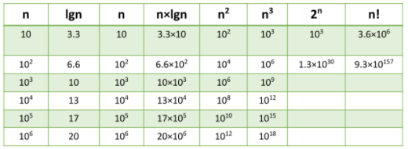
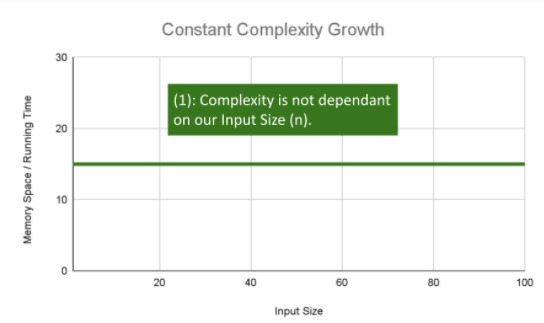
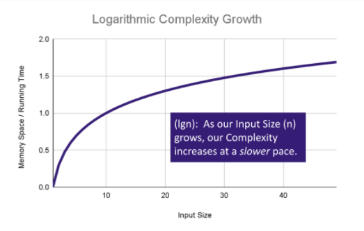
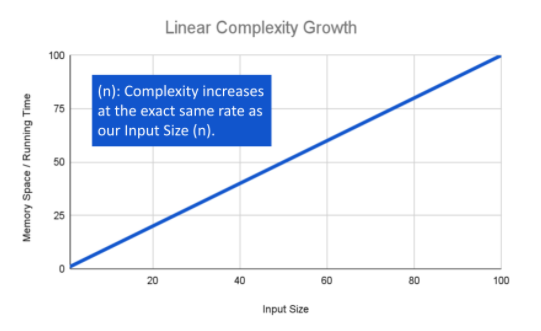
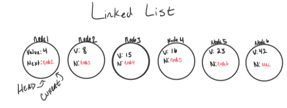
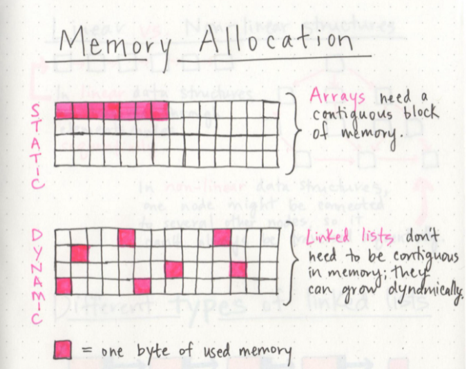

# Big O: Analysis of the Algorithm Efficiency

Used to describe the efficiency of an algorithm or function.

**Efficiency is evaluated based on 2 factors:**

1. Running Time (also known as time efficiency / complexity)
The amount of time a function needs to complete.

2. Memory Space (also known as space efficiency / complexity)
The amount of memory resources a function uses to store data and instructions.

Algorithm efficiency is to describe the Worst Case.

**Analyze Space and Time considering:**
1. Input Size 
2. Units of Measurement
3. Orders of Growth
4. Best Case, Worst Case, and Average Case

1. Input Size
The size of the parameter values that are read by the algorithm
(Size and number of parameters that the algorithm reads)
    *The higher the Input Size the more likely there will be an increase to Running Time and Memory Space.*

3. Units of Measurement
**To quantify the Running Time in our analysis:**
    Three Measurments of time:
    1. The time in milliseconds from the start of a function execution until it ends.
        For the purposes of Big O, we won’t be considering this measurement because it depends on the machine.
    2. The number of operations that are executed.
        Number of lines of code that are executed from start to finish of a function.
    3. The number of “Basic Operations” that are executed.
        This is the most time consuming operation within the inner most loop.

**To quantify the Memory Space in our analysis:**
    Four Sources of Memory Usage during function run-time:
    1. The amount of space needed to hold the code for the algorithm
        Number of bytes required to store the characters for the instructions specified in your function.
    2. The amount of space needed to hold the input data
        If direct input data is not considered, we may just refer to this as Additional Memory Space since not all functions have direct input values.
    3. The amount of space needed for the output data
    4. The amount of space needed to hold working space during the calculation
        Working Space can be thought of as the creation of variables and reference points as our function performs calculations. This will also include Stack Space of recursive function calls

4. Orders of Growth
Represents the increase in Running Time or Memory Space.

**Constant Complexity Growth**
No matter what inputs are thrown at our algorithm, it always uses the same amount of time or space
The number 1 is used to represent a constant value. 
*Complexity growth*: O(1)

**Logarithmic Complexity Growth**
A decrease in the rate of complexity growth, the greater our value of the input size.
*Complexity growth*: O(lgn)

**Linear Complexity Growth**
The size of our inputs will directly determine the amount of Memory Space used and Running Time length. 
This is a very common efficiency and is usually used to denote functions with loops, or often algorithms that use recursion.
*Complexity growth*: O(n)

# Linked Lists
A node is a collection of two sub-elements or parts. A data part that stores the element and a next part that stores the link to the next node.
A Linked List is a sequence of Nodes that are connected/linked to each other.
Order of operations is extremely important when it comes to working with a Linked List

Two Types of Linked List:
1. Singly
2. Doubly

**Terminology**
1. Linked List - A data structure that contains nodes that links/points to the next node in the list.
2. Singly - Singly refers to the number of references the node has. A Singly linked list means that there is only one reference, and the reference points to the Next node in a linked list.
3. Doubly - Doubly refers to there being two (double) references within the node. A Doubly linked list means that there is a reference to both the Next and Previous node.
4. Node - Nodes are the individual items/links that live in a linked list. Each node contains the data for each link.
5. Next - Each node contains a property called Next. This property contains the reference to the next node.
6. Head - The Head is a reference of type Node to the first node in a linked list.
7. Current - The Current is a reference of type Node to the node that is currently being looked at. When traversing, you create a new Current variable at the Head to guarantee you are starting from the beginning of the linked list.

**Traversal**
We depend on the Next value in each node to guide us where the next reference is pointing. The Next property is exceptionally important because it will lead us where the next node is and allow us to extract the data appropriately.

The best way to approach a traversal is through the use of a while() loop. This allows us to continually check that the Next node in the list is not null. If we accidentally end up trying to traverse on a node that is null, a NullReferenceException gets thrown and our program will crash/end.

**Traversal Big O**
If we are looking for a specific node 
Big O of time: O(n)
Big O of space: O(1)
If we are adding a new node
Big O of time: O(1)
Big O of space: O(1)

**Adding a Node**
Adding O(1)
1. Replace the current Head of the linked list with the new node, without losing the reference to the next node in the list.
2. Then instantiate the new node that we are adding. The values passed in as arguments into the Add() method will define what the value of the Node will be.
3. newNode.Next by default is set to null. We want to set newNode.Next property to the same location that the Head node is pointing towards. Because Head is just a reference type, we will be assigning it to the same allocation in memory as the node it is pointing too. In this case, it’s Node1.
4. We now have to re-assign where Head is pointing too. Since Node1 is no longer the first node in the list, we want to re-assign Head to point at newNode.

**Adding a Node O(n)**
Check: [Adding Node O(n)](https://codefellows.github.io/common_curriculum/data_structures_and_algorithms/Code_401/class-05/resources/singly_linked_list.html)

# Data Structures
The different ways that we can organize our data: variables, arrays, hashes, and objects are all types of data structures.
Linked list are linear data structures (in order to get to the end of the list, we have to go through all of the items in the list in order, or sequentially.)

**what makes arrays and linked lists different?**
Memory management:
The biggest differentiator between arrays and linked lists is the way that they use memory in our machines
The fundamental difference between arrays and linked lists is that arrays are static data structures, while linked lists are dynamic data structures.

**Parts of linked lists**

    A node only knows about what data it contains, and who its neighbor is.
    