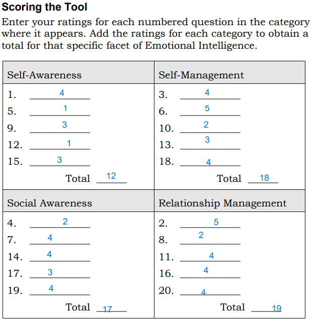
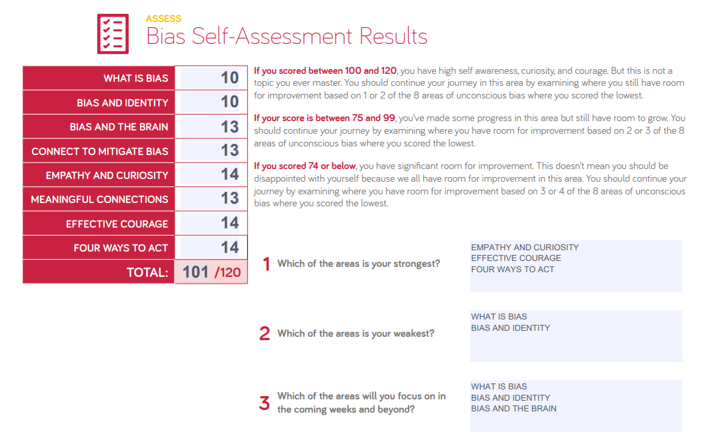

# Upgrade your technical skills with deliberate practice

> PUSH YOUR SELF OUT OF YOUR COMFORT ZONE!

**Software Development** is not about instructions or guidelines you should follow to be successful, its all about continuously searching, learning new things, experiencing new challenges.

A **software developer** that is facing the same issues, errors, or problems every time is not about the improvement of the technical skills. To improve the technical skills than a one has new challenges should be experienced, going through complicated errors or problems and reach out the solution for them is all about development of yourself in the feild.

When going through a specific challenge with a hard work and many times of failing to solve it, will be leading you to the correct way of learning and improving yourself.
Finally after reaching to your solution, try sending your solution to others, take a feedback from them.
Negative feedback or comments will grow your code to be more clean, organized, with the correct logic. Going through others errors and solutions can be also helpful for you to experience more than one way of solving one problem.

> IF YOU ARE NOT EXHAUSTED AFTER A TECHNICAL CHALLENGE, YOU ARE NOT LEARNING NEW THINGS!

### TRY: 
- Always *challenge yourself* with problems that can't be solved quickly or requires all your thinking and concentration, you should search, try, fail, get exhausted to reach to the desired solution.

- *Link your skills* to real world problems.

- *Keep on* reaching new coding languages, new skills, new techniques and new challenges to get to the right place.

# The power of believing that you can improve

Failing doesn't mean that you should stop, this should challenge you to try again and again until you reach to the desired goal.

Failing in solving a task once or a couple of times means that you didn't solve it **yet** but you will do it, trust yourself.

Assigned tasks that are at higher level from where you are should excite you to try, challenge yourself and fail many times but at the end you will reach to the result.

Keep in mind that the results are not necessary, the most important thing to take into consideration is:
- The process taken into account.

- The efforts done to reach to the desired results.

- The way of thinking or brainstorming.

- The way of breaking down a problem to small parts that can be solved.

> THIS IS WHAT A GROWTH MINDSET IS ALL ABOUT!

# The power of passion and perseverance

- The systematic way of learning that the schools and universities follow, should be changed, learning should be from a motivational and psychological prespectives.

- The main idea that everyone should follow is that with efforts and hard work anyone can acheive the desired results that he/she is willing to reach, grades are not the thing that defines the persons abilities and capabilities.

- A person should stay motivated to reach and accomplish goals, so keep on trying new things and experience them deeply to enjoy the learning process.

- A person with grit has passion and perseverance, sets the goal and worked really hard to achieve and reach out to success.

- A person should make use of the failures and learn lessons from them, instead of giving up.

# A kinder, gentler philosophy of success

- The most important thing to do before you start achieving your goals, do not haphazardly arrange them.

- Focus on what you want to do, not just what others wants to see you doing.

- Make sure that with continous hard word and passion for your longtime goals, you can acheive and reach your dream destination.

- Usually what makes us afraid of failing is not the idea of "I failed to do this thing so I can't continue or I can't get into my dream job and be successful in my carrer path" its all about the fear of being judged by others. So keep in mind you will NEVER please everyone, failing once and twice is not the thing that describes what you are, so keep on trying and trying until you are pleased with the results.

- Avoid being envy, Do not compare yourself with others because each person struggles in a way and goes through different ups and downs.

- Avoid being snobby, Do not less of a person because they disagree with you, or because they do not adopt specific values that are important in your point of view, respect others and understand that everyone has his own way of living.

# Measuring Emotional Intelligence
Results:

I have a good Self Management and Relationship Management,

I should improve my-self in Self Awareness and Social Awareness by:

- Minimizing distractions

- Being able to recognize emotions

- Identifying responsibilities in a systematic way

- Ask more questions

# Assessing Bias
Results:

I have high self awareness, curiosity, and courage. I should continue my journey in this area by examining where I still have room for improvement in areas where I got the lowest scores