# Introduction to SQL

## SQL Language allows technical and non-technical users to: (from a relational database)
- Query
- Manipulate
- Transform

## SQL Databases:
- Provides safe and scalable storage for websites and mobile applications.
- Supports common SQL language standard, (differ in features and storage).

## Relational Databases:
- Contains data that are organized in tables which are a type of entity.
- Stores data and provides access to it.
- Tables in relational database have common relationships.
- Tables consist of columns and rows 
	  *Columns:* 
    - Columns of a table is the properties or attributes 
	- Each column has a specific datatype (integer, varchar, date, ...etc)
	  *Rows:* (Instance of the type of entity)
	- Values for the properties assigned in the columns

### Exersise#1
**To retrieve data from SQL database:**
SELECT statements (queries)

**Query is a statement that:**
   - Declares the data we are looking for.
   - Where to find the data.
   - How to transform data before it is returned.

#### Syntax:
*To specific columns*
    SELECT column1, column2, ...
	FROM table_name;

*To select all columns*
	SELECT * FROM table_name;

#####  Solution:
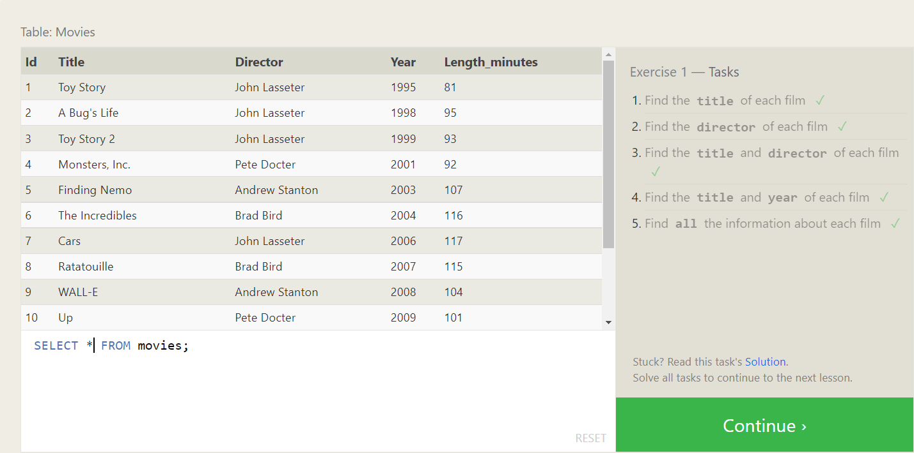

## Exercise#2
**Queries with constraints (Pt.1)**
To filter some methods from being returned WHERE clause is used

#### Syntax:
    SELECT column, another_column, …
	FROM mytable
	WHERE condition
    	AND/OR another_condition
    	AND/OR …;

**Complex Clauses can be constructed by joining operators:**
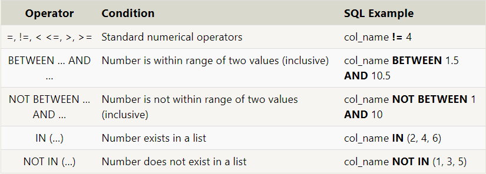

#####  Solution:
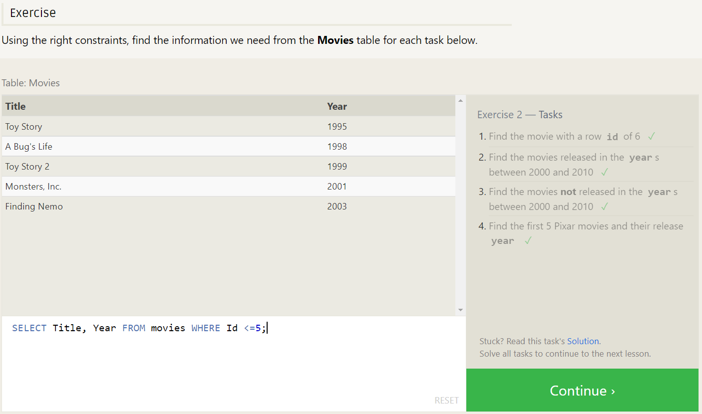

### Exercise#3
**Queries with constraints (Pt.2)**
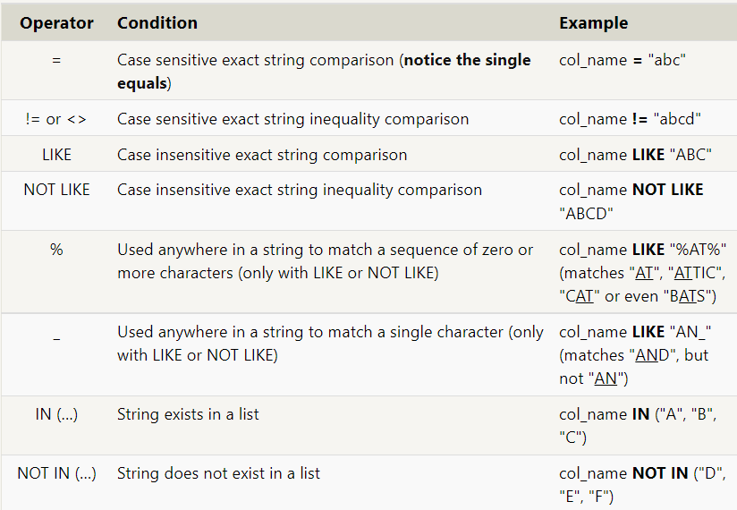

#####  Solution:
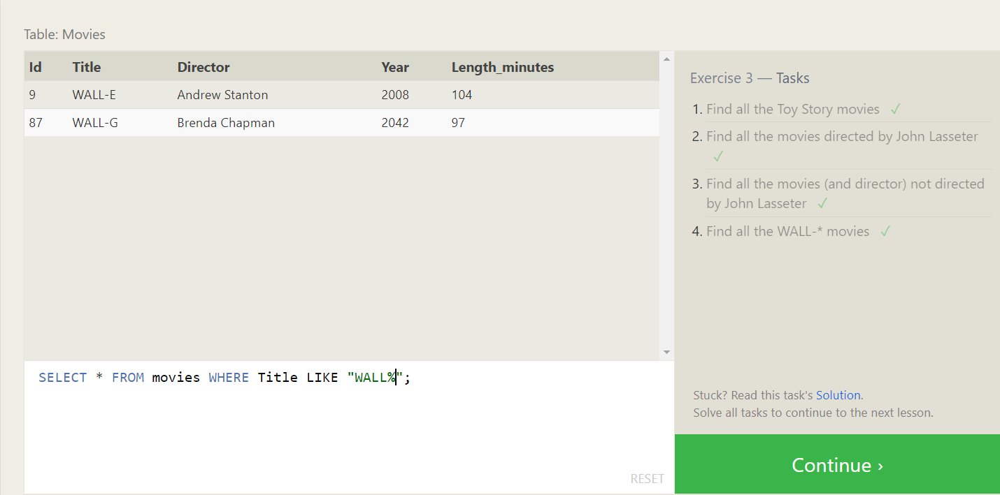

## Exercise#4
**DISTINCT KEYWORD:**
- Discard or remove duplicate rows.
- We can discard diplicates based on specific columns by grouping.

#### Syntax: 
    SELECT DISTINCT column, another_column, …
	FROM mytable
	WHERE condition(s);

**ORDER BY KEYWORD:**
- Sort the results by a given column in ascending or descending order.
- Each row is sorted alpha-numerically based on the specified column's value.

#### Syntax: 
    SELECT column, another_column, …
    FROM mytable
    WHERE condition(s)
    ORDER BY column ASC/DESC;

**Clauses used with ORDER BY:**
- LIMIT: Limit the number of rows to return
- OFFSET: Set the number of rows to return (Where to begin)

#### Syntax: 
	SELECT column, another_column, …
	FROM mytable
	WHERE condition(s)
	ORDER BY column ASC/DESC
	LIMIT num_limit OFFSET num_offset;

##### Solution:
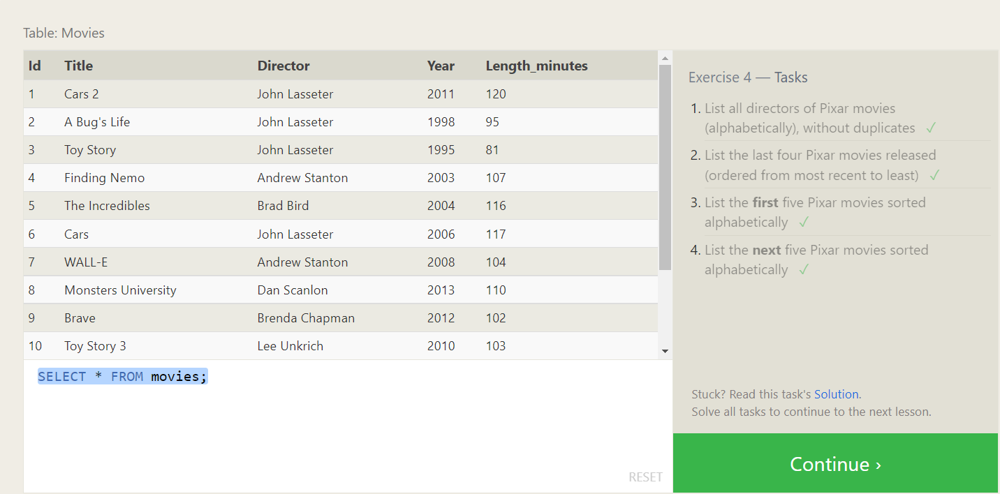

## Exercise#5
**Simple SELECT Queries**

##### Solution:
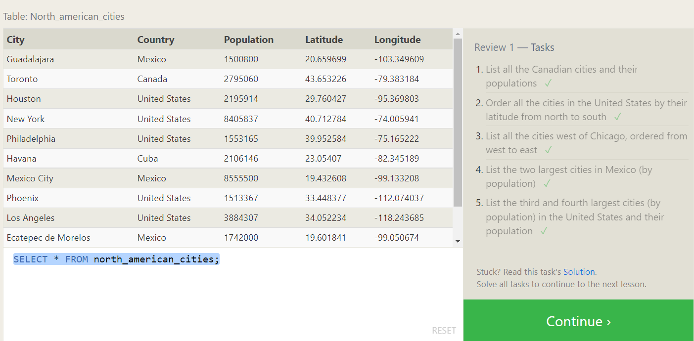

## Exercise#6
**Data Normalization**
Tables are usually broken down into pieces and stored across multiple orthogonal tables using Normalization.
- It minimize duplicate data in a single table.
- Allows data to grow independently of each other.

**Multi-table queries with JOINs**
Tables that share information about single-table entity should have a primary key that identifies that entity uniquely across the database.

**JOIN**
Combine row data across two separate tables using the unique key.
**INNER JOIN**
Matches rows from the first table and the second table which have the same key

#### Syntax: 
	SELECT column, another_table_column, …
	FROM mytable
	INNER JOIN another_table 
    	ON mytable.id = another_table.id
	WHERE condition(s)
	ORDER BY column, … ASC/DESC
	LIMIT num_limit OFFSET num_offset;

##### Solution:
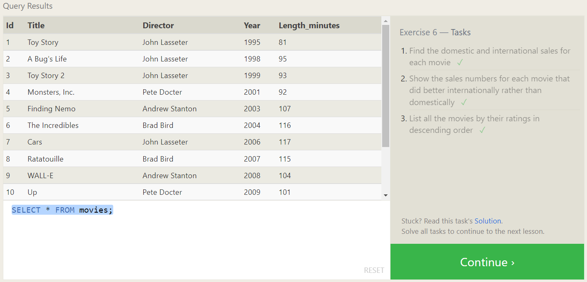

## Exercise#13:
Database schema is what describes the structure of each table, and the datatypes that each column of the table can contain.
**Inserting new data**
- Insert statement with specific columns
	INSERT INTO mytable
	(column, another_column, …)
	VALUES (value_or_expr, another_value_or_expr, …),
      	(value_or_expr_2, another_value_or_expr_2, …),
     	…;
- Insert statement with values for all columns
	INSERT INTO mytable
	VALUES (value_or_expr, another_value_or_expr, …),
       	(value_or_expr_2, another_value_or_expr_2, …),
       	…;

##### Solution:
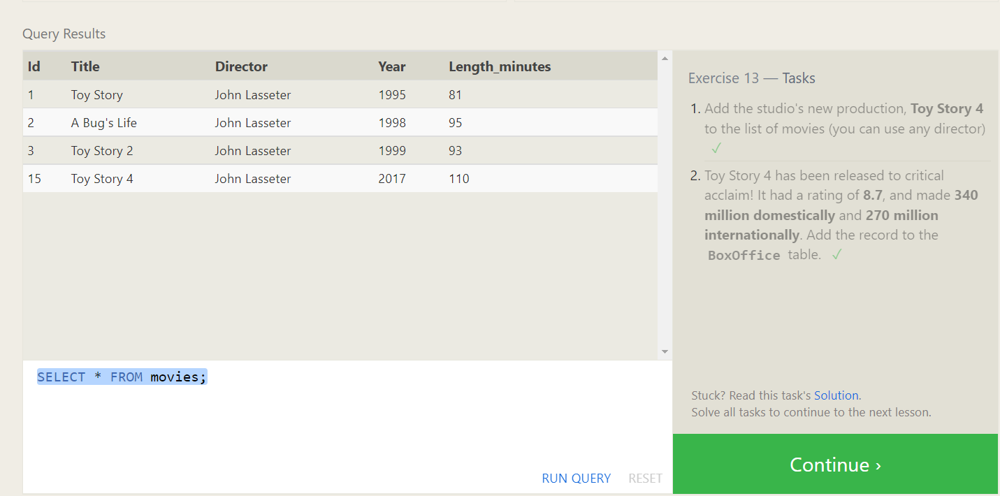

## Exercise#14:
**Updating rows**
Update existing data

#### Syntax:
	UPDATE mytable
	SET column = value_or_expr, 
    	other_column = another_value_or_expr, 
    	…
	WHERE condition;
##### Solution:
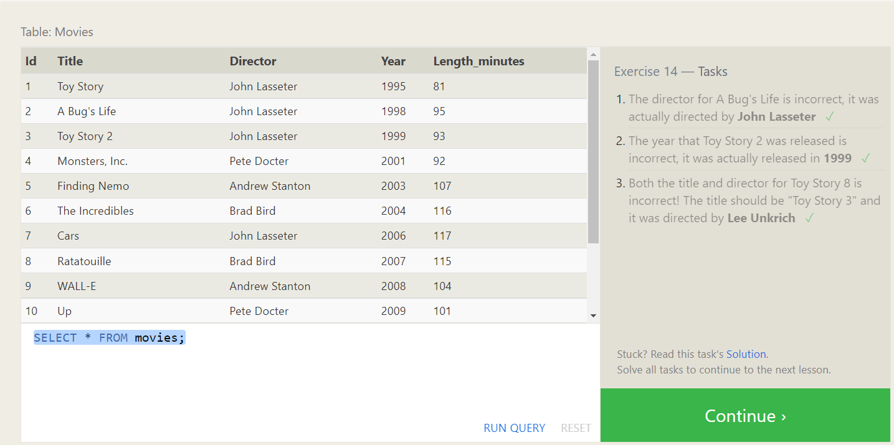

## Exercise#15:
**Deleting Rows**
Delete data from a table in the database.

#### Syntax:
	DELETE FROM mytable
	WHERE condition;
When the WHERE condition is removed all rows will be removed.

##### Solution:
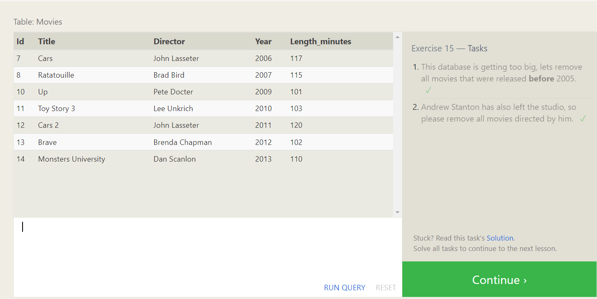

## Exercise#16:
**Creating tables**
- To store new entries and relationships in the database, create new database using:
- Each column has a name, the type of data allowed in that column, an optional table constraint on values being inserted, and an optional default value.
CREATE Statement

#### Syntax:
	CREATE TABLE IF NOT EXISTS mytable (
    	column DataType TableConstraint DEFAULT default_value,
    	another_column DataType TableConstraint DEFAULT default_value,
   		 …
    );

#### Table Data Types:
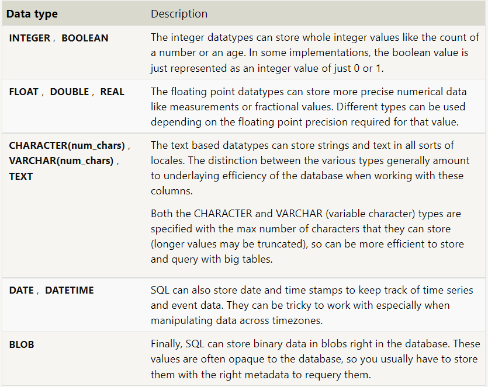

#### Table Constraints:
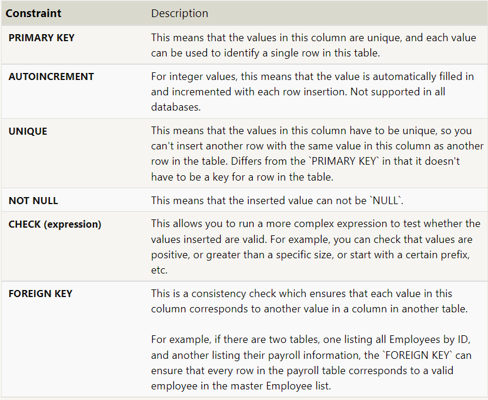

##### Solution:
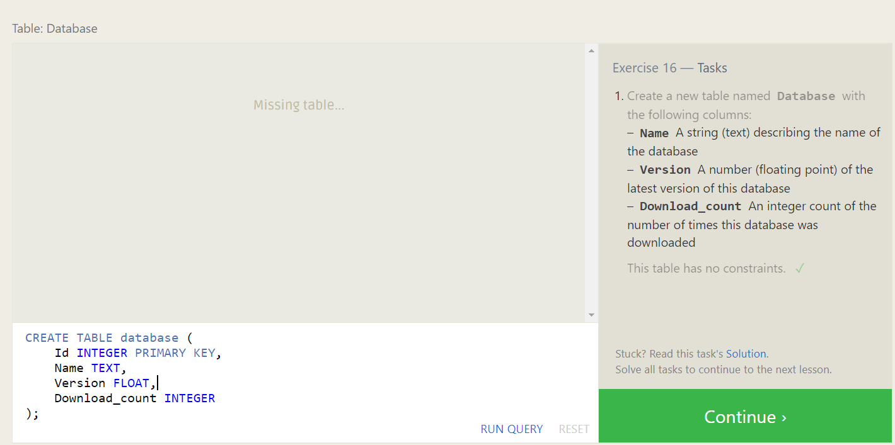

## Exercise#17:
**Altering tables**
To add, remove, or modify columns and table constraints.

**Adding Columns**

#### Syntax:
	ALTER TABLE mytable
	ADD column DataType OptionalTableConstraint 
    	DEFAULT default_value;

**Removing columns**

#### Syntax:
	ALTER TABLE mytable
	DROP column_to_be_deleted;

**Renaming the table**

#### Syntax:
	ALTER TABLE mytable
	RENAME TO new_table_name;

##### Solution:
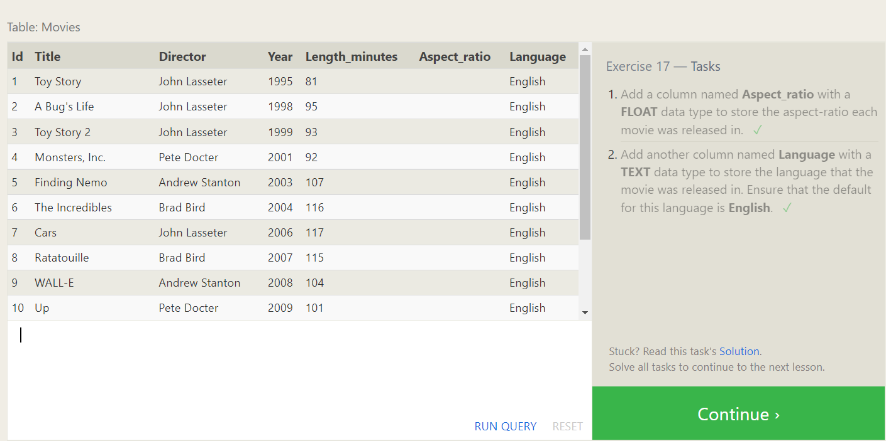

## Exercise#18:
**Dropping tables**
To remove an entire table including all of its data and metadata

#### Syntax:
	DROP TABLE IF EXISTS mytable;S

##### Solution:
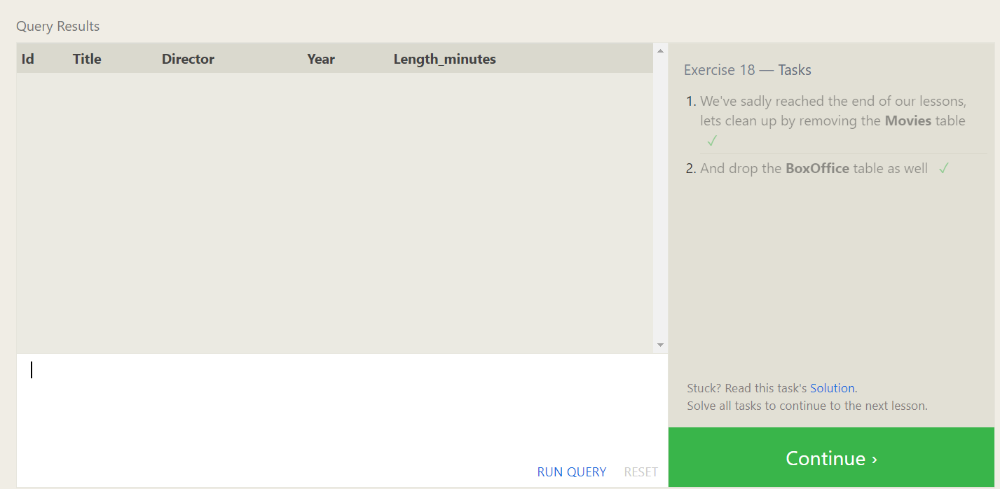S